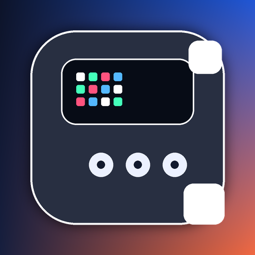

# Divoom Ditoo Pro Mac

<p align="center">
  
</p>

<p align="center">
  
  
  
  
  
</p>

Native macOS control for the Divoom Ditoo Pro display path.

This project is not a web wrapper and not an iPhone relay. The running menu bar app owns Bluetooth, the CLI talks to that app over local IPC, and the Mac pushes pixels, clocks, telemetry, and live status surfaces straight to the `DitooPro-Light` endpoint.

Current release line: `0.3.0-beta.6`. Version source of truth: [`VERSION`](VERSION). Treat this repo as a fast-moving beta with real native transport and incomplete vendor-parity work above it.

## Product Overview

What exists right now:

- native menu bar app in Swift/AppKit
- direct BLE transport from macOS
- local CLI bridge for scripting and automation
- native animation library window with favorites, recents, filters, previews, and beam actions
- native cloud-backed library ingestion and sync path
- live feed surfaces for Codex, Claude, split status, IP flag, and favorites rotation
- on-device dashboards for battery, system, memory, thermal, network, clocks, and timer surfaces

What this is trying to be:

- the Mac-native control plane for a Ditoo Pro
- a truthful native alternative to phone-first workflows
- a product-grade shell around transport, content, and live integrations

## Feature Matrix

| Surface | Status | Current truth |
| --- | --- | --- |
| Native BLE transport | Shipped | Direct CoreBluetooth control from the menu bar app is working. |
| Static color + ambient RGB | Shipped | Includes the IPA-confirmed `0x6f` purity RGB path. |
| Static image push | Shipped | Exact `16x16` pixel rendering is working. |
| Frame-streamed animations | Shipped | Mac-driven animation playback is working. |
| CLI -> app IPC bridge | Shipped | `divoom-display` forwards into the running app instead of opening a second BLE stack. |
| Menu bar shell | Shipped, active polish | Native shell is real and usable, but still being tightened aggressively. |
| Native animation library | Shipped, active polish | Favorites, recents, filtering, previews, and inspector actions are live. |
| Device dashboards | Shipped | Battery, system, memory, thermal, network, animated monitor, analog clock, animated clock, and Pomodoro timer are present. |
| CodexBar / Claude live feeds | Shipped, beta-grade | Native live surfaces are present and configurable. |
| Divoom cloud login + sync | Verified beta | Save or import verifies against the live Divoom account before the app persists the local Keychain copy, and the app now syncs store lanes through `--auto-store-sync`. |
| Cloud search + like / unlike | Working beta | Gallery like / unlike runs through `GalleryLikeV2`, and store/channel like / unlike runs through live-verified `Channel/LikeClock`. |
| Store/classify parity | Partial, live-verified | `Channel/StoreClockGetClassify`, `Channel/StoreClockGetList`, `Channel/StoreTop20`, `Channel/StoreNew20`, and `Channel/StoreGetBanner` are live-verified once blue-device context is registered with `Type=26` / `SubType=1`, and banner data is now captured in the synced manifest. Wider flag mapping, `0x1a` `encrypt_type 21`, and full activation parity still remain open. |
| Search payload parity | In progress | `Channel/ItemSearch` still needs exact payload parity work. |
| Vendor-style autonomous gallery/channel playback | Not finished | Upload is not the hard part; post-upload activation parity is still under reverse engineering. |

## Install

There are three real install modes and one current truth: only the source-driven paths install the CLI.

| Path | Command / artifact | Installs | Notes |
| --- | --- | --- | --- |
| One-line install | `curl -fsSL https://raw.githubusercontent.com/kirniy/divoom-ditoo-pro-mac/main/install.sh | bash` | App + CLI + support repo checkout | Best option if you want the product and automation surface together. |
| `.pkg` release | `build/release/DivoomDitooProMac-<version>.pkg` | App only | Straight installer artifact. No CLI symlink. |
| `.zip` release | `build/release/DivoomDitooProMac-<version>.zip` | App only | Good if you just want the bundle. No CLI setup. |
| Source build | `./bin/build-divoom-menubar-app` | Built app in `build/` | Best for local development and current-repo testing. |

One-line installer requirements:

- macOS
- `git`
- `python3`
- Xcode Command Line Tools with `swiftc`

Current packaging commands:

```bash
./bin/build-divoom-menubar-app
./bin/package-release-artifacts
```

Release artifacts generated locally:

- `build/release/DivoomDitooProMac-0.3.0-beta.6.zip`
- `build/release/DivoomDitooProMac-0.3.0-beta.6.pkg`

Install detail and first-launch steps live in [`docs/INSTALL.md`](docs/INSTALL.md).

## Quick Start

Launch the app once, accept Bluetooth, then push something simple:

```bash
./bin/divoom-display native-open-app
./bin/divoom-display native-headless scene-color --color '#247cff'
./bin/divoom-display native-headless pixel-test
./bin/divoom-display native-headless animated-monitor
```

Control path:

```text
CLI -> local IPC -> DivoomMenuBar.app -> CoreBluetooth -> DitooPro-Light
```

Verified BLE anchors on this device:

- service: `49535343-FE7D-4AE5-8FA9-9FAFD205E455`
- write characteristic: `49535343-8841-43F4-A8D4-ECBE34729BB3`
- notify/read characteristic: `49535343-1E4D-4BD9-BA61-23C647249616`

## Current Parity Status

| Area | Status | Notes |
| --- | --- | --- |
| Native transport | Verified | Real macOS BLE control is the default path. |
| Native library UX | Usable, not settled | The library window is live but still under active redesign and refinement. |
| Cloud library | Beta, verified auth | Login is verified against the live backend, and the app now shells into the sync tool with `--auto-store-sync` for store-backed cache refreshes. |
| Vendor channel/store parity | Partial, live-verified | The JSON `Command` field is required, blue-device registration is live, and the core store endpoints work, including `StoreGetBanner` when device context is present and cached into the manifest. Wider flag mapping, `encrypt_type 21`, and full live browser parity remain open. |
| Upload-to-playback parity | Incomplete | Autonomous playlist/channel behavior after upload is not claimed as solved. |
| Integrations | Mixed | CodexBar and Claude live surfaces are real; OpenClaw is present as a scaffold/integration lane, not a finished app surface. |

For the protocol and product roadmap, see [`docs/PRODUCT_PARITY_PLAN.md`](docs/PRODUCT_PARITY_PLAN.md).

For cloud-specific status, see [`docs/DIVOOM_CLOUD_SYNC.md`](docs/DIVOOM_CLOUD_SYNC.md).

## Screenshots

There is no `docs/screenshots/` directory in the repo today, so this README does not pretend full app screenshots exist yet.

Current checked-in visuals are motion previews in `docs/assets`:

<p align="center">
  
  
</p>

Once static screenshots land under `docs/screenshots/`, this section should point there.

## Native Surfaces

### App shell

- menu bar shell for transport, live modes, device actions, library, and settings
- native quick actions for Codex Live, Claude Live, Split Live, IP Flag, Library, Favorites Rotation, and color pick
- settings surface for launch-at-login, live feed behavior, cloud credentials, logs, version/build info, and links

### Library

- native animation library window
- search, category filters, grid/list browsing, favorites, recents, and inspector actions
- local asset root: `assets/16x16/divoom-cloud`
- native cloud sync/search entry points in the library and settings flows

### Device utilities

- Battery Dashboard
- System Dashboard
- Memory Dashboard
- Thermal Dashboard
- Network Dashboard
- Animated Monitor
- Analog Clock
- Animated Clock
- Pomodoro Timer

## Versioning Note

The repo is using semantic versioning with a prerelease label right now.

- current version: `0.3.0-beta.6`
- source of truth: [`VERSION`](VERSION)
- release stage: early beta

Do not read `beta.6` as product-finished. The native stack is real; the remaining work is on parity, polish, and vendor-behavior recovery.

## Troubleshooting

Fast truth before you debug:

- if the app is not running, the CLI will look broken because it only talks to the running app
- if `DitooPro-Audio` appears but colors and animations fail, the real display path is still missing; recover `DitooPro-Light`
- if you installed from `.pkg` or `.zip`, missing `divoom-display` is expected because those installs are app-only
- if cloud UI is visible but cloud actions fail, confirm the app has a local saved Keychain copy of the credentials
- if cloud auth works but store lanes still look thin, remember the app browses the local cache; Sync Cloud now uses `--auto-store-sync`, banners are cached once device context is present, and the remaining thin spots are wider flag mapping plus the still-unsupported `0x1a` / `encrypt_type 21` assets

Start here:

- install and first launch: [`docs/INSTALL.md`](docs/INSTALL.md)
- troubleshooting guide: [`docs/TROUBLESHOOTING.md`](docs/TROUBLESHOOTING.md)
- cloud auth and sync: [`docs/DIVOOM_CLOUD_SYNC.md`](docs/DIVOOM_CLOUD_SYNC.md)

Primary app log:

```text
~/Library/Logs/DivoomMenuBar.log
```

## Attributions

This repo is not all original surface area. It vendors and builds on upstream work, and those credits need to stay explicit.

Current notable attributions:

- `redphx/apixoo` for the Divoom cloud client base used in the native cloud sync path
- OpenPeon `cute-minimal` for product sounds
- provider icon resources for Codex and Claude brand surfaces

Full attribution detail lives in [`docs/ATTRIBUTIONS.md`](docs/ATTRIBUTIONS.md).

## Repo Pointers

- installer: [`install.sh`](install.sh)
- app build: [`bin/build-divoom-menubar-app`](bin/build-divoom-menubar-app)
- release packaging: [`bin/package-release-artifacts`](bin/package-release-artifacts)
- CLI entrypoint: [`bin/divoom-display`](bin/divoom-display)
- native app source: [`macos/DivoomMenuBar`](macos/DivoomMenuBar)
- parity roadmap: [`docs/PRODUCT_PARITY_PLAN.md`](docs/PRODUCT_PARITY_PLAN.md)
- troubleshooting: [`docs/TROUBLESHOOTING.md`](docs/TROUBLESHOOTING.md)
- attributions: [`docs/ATTRIBUTIONS.md`](docs/ATTRIBUTIONS.md)

Releases: <https://github.com/kirniy/divoom-ditoo-pro-mac/releases>
